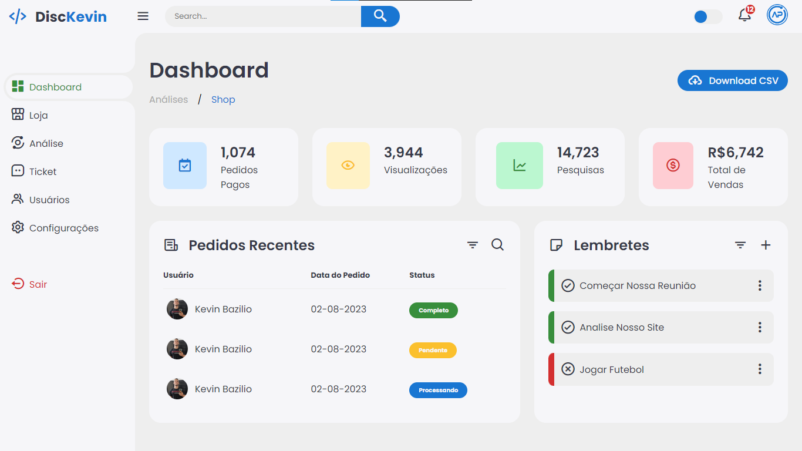
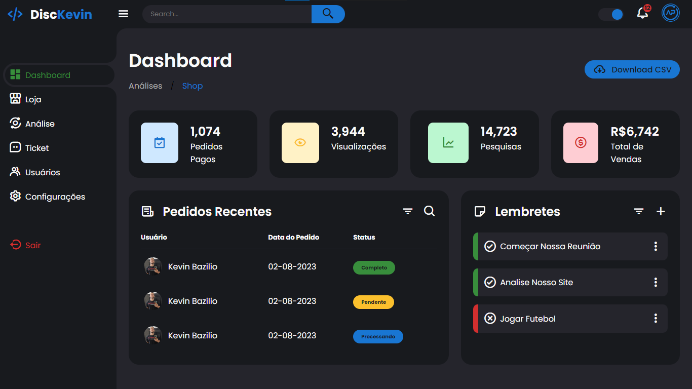

<h1 align="center">Responsive Dashboard</h1>

Esse projeto é um dashboard responsivo, trabalhando técnica de "menu aside" e "toggle".  

  <a href="#-tecnologias">Tecnologias</a>&nbsp;&nbsp;&nbsp;|&nbsp;&nbsp;&nbsp;
  <a href="#-ensino">Ensino</a>&nbsp;&nbsp;&nbsp;|&nbsp;&nbsp;&nbsp;

 

  

  

## 🚀 Tecnologias

Esse projeto foi desenvolvido com as seguintes tecnologias:

- HTML, CSS e JS
- Git, Github

## 🔖 Ensino

Você pode visualizar o passo-a-passo do projeto através [DESSE LINK](https://www.youtube.com/watch?v=D88K1esxwuo).
